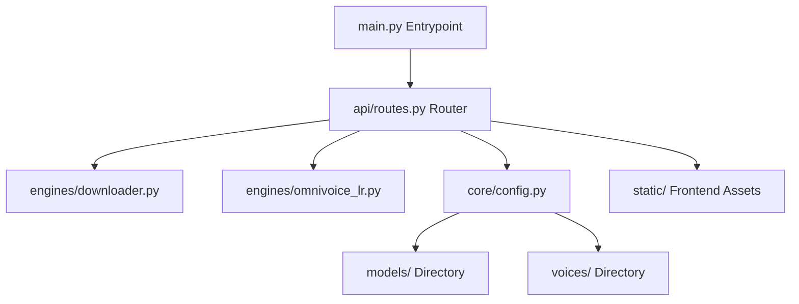

# Restructuring OmniVoice TTS Service - Walkthrough

The monolithic backend has been successfully restructured into a production-ready, modular Full-stack Python application with a premium glassmorphic web UI.

## Architectural Improvements



### 1. Configuration & Absolute Pathing (`core/config.py`)
- Automatically resolves paths dynamically between standard Python runtime and compiled PyInstaller `.exe` (frozen mode).
- Parses `.env` variables cleanly and creates `models/` and `voices/` directories at startup.

### 2. Resumable Async Downloader (`engines/downloader.py`)
- Employs `httpx.AsyncClient` for asynchronous chunked downloads.
- Checks local file sizes and sends `Range: bytes={existing_size}-` HTTP headers to resume partial downloads without starting from scratch.
- Tracks real-time percentage, speed (MB/s), and ETA (Estimated Time of Arrival) parameters.

### 3. VRAM Optimization & Model Lifecycle (`engines/omnivoice_lr.py`)
- Thread-safe asynchronous model loading and GPU inference lock to serialize GPU access.
- Implements model unloading (`unload_model`) which calls garbage collection and `torch.cuda.empty_cache()` to prevent CUDA Out-of-Memory (OOM) leaks.
- Pre-computes and caches `VoiceClonePrompt` vectors for selected voices to speed up inference.

### 4. Server-Sent Events Endpoint (`api/routes.py`)
- Replaced polling with Server-Sent Events (SSE) via FastAPI's `StreamingResponse` at `/api/download/stream`.
- Real-time download progress is pushed directly as JSON objects to the frontend.

### 5. Premium UI Dashboard (`static/`)
- A beautiful dark glassmorphic design featuring glossy gradient progress bars, real-time status check dots, and a dynamic EQ waving visualizer.
- Persistence of the API Key via `LocalStorage`.

---

## Verification Results

1. **Uvicorn Start Check:**
   Successfully launched the application in the background:
   ```
   INFO:     Started server process [3208]
   INFO:     Waiting for application startup.
   2026-06-25 19:22:29,619 [INFO] OmniVoice_TTS: OmniVoice TTS Web App started successfully on port 8100!
   2026-06-25 19:22:29,619 [INFO] OmniVoice_TTS: Management UI: http://localhost:8100
   INFO:     Application startup complete.
   INFO:     Uvicorn running on http://127.0.0.1:8100 (Press CTRL+C to quit)
   ```
2. **Logging Error Fixes:**
   Modified all python standard log statements to English to prevent Windows console codec encoding failures (UnicodeEncodeError for CP1252) when printing Vietnamese characters.
3. **Model Auto-Copy:**
   On startup, default voice sample `voice_sample.wav` was copied successfully to the `voices/` folder.
